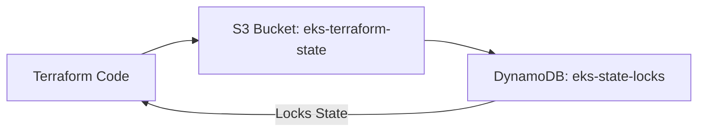
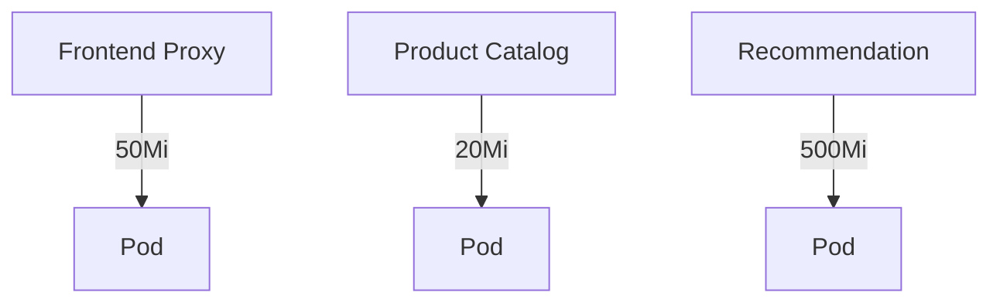
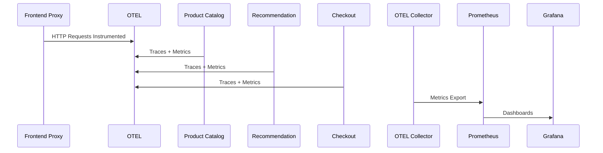
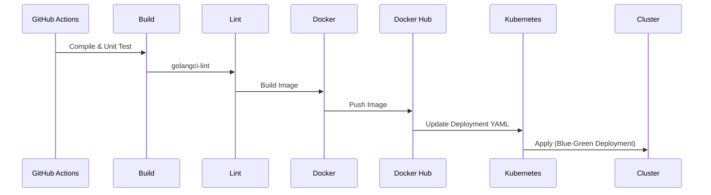

<!--
**Owner:** KamoEllen
**Repo:** [Ecommerce-Devops-Pipeline](https://github.com/KamoEllen/Ecommerce-Devops-Pipeline)
**Status:** Completed

---
-->

## **Table of Contents**

1. [Project Overview](#project-overview)
2. [System Architecture](#system-architecture)
3. [Infrastructure Design](#infrastructure-design)
4. [Microservices Architecture](#microservices-architecture)
5. [Observability](#observability)
6. [CI/CD Pipeline](#cicd-pipeline)
7. [Key Architectural Decisions](#key-architectural-decisions)
8. [Challenges and Solutions](#challenges-and-solutions)
9. [Areas for Improvement](#areas-for-improvement)
10. [Conclusion](#conclusion)

---

 

## **Project Overview**

Migrated the **OpenTelemetry Demo** microservices application to **AWS EKS**, building secure, autoscaling infrastructure with observability, fault tolerance, and production-ready DevOps practices.

**Focus:**

* Product Catalog service
* Recommendation service
* Frontend Proxy service

**Objectives:**

* Deploy and operate a cloud-native microservices system
* Maintain scalability and observability for user-facing services
* Implement CI/CD for automated, zero-downtime deployments

---

## **System Architecture**

### **High-Level Architecture**

```mermaid
flowchart TD
%% Terraform Modules
A[Terraform VPC Module] --> B[EKS Cluster Module]
A --> C[State Backend: S3 + DynamoDB]
B --> D[Private Subnets]
B --> E[Public Subnets]
B --> F[Node Groups: t3.medium → t3.large]
B --> G[ALB Ingress Controller]

%% Microservices
G --> H[Frontend Proxy (Next.js)]
G --> I[Product Catalog (Go + OTEL)]
G --> J[Recommendation (Go + OTEL)]
G --> K[Checkout (Go + OTEL)]
I --> L[Kafka Broker]
J --> L
K --> L

%% Observability
I --> M[OTEL Collector]
J --> M
K --> M
M --> N[Prometheus]
N --> O[Grafana Dashboards]

%% Connections Notes
D -->|Pods scheduled| I
D -->|Pods scheduled| J
D -->|Pods scheduled| K
E -->|Ingress endpoints| H

%% CI/CD Pipeline
subgraph CI/CD
    P[GitHub Actions: Product Catalog] --> Q[Build & Unit Test]
    Q --> R[Lint: golangci-lint]
    R --> S[Docker Image Build & Push]
    S --> T[Kubernetes Deployment Update]
    T --> F
end

%% Styling for clarity
classDef infra fill:#f9f,stroke:#333,stroke-width:2px;
classDef svc fill:#bbf,stroke:#333,stroke-width:2px;
classDef obs fill:#bfb,stroke:#333,stroke-width:2px;
class A,B,C,D,E,F,G infra;
class H,I,J,K,L svc;
class M,N,O obs;
```
&
```mermaid
graph TD
A[Frontend Proxy (Next.js)] --> B[ALB Ingress + Envoy]
B --> C[Product Catalog (Go + OTEL)]
B --> D[Recommendation (Go + OTEL)]
B --> E[Checkout (Go + OTEL)]
C --> F[Kafka Broker]
D --> F
E --> F
C --> G[OTEL Collector]
D --> G
E --> G
G --> H[Prometheus + Grafana]
```

**Notes:**

* ALB handles host-based routing and public access
* Private subnets isolate backend services
* Kafka provides async communication between microservices
* OTEL Collector aggregates telemetry for Prometheus/Grafana

---

## **Infrastructure Design**

### **AWS Foundation**

* **EKS Cluster:** Deployed in private subnets
* **VPC Configuration:**

  * CIDR: `10.0.0.0/16`
  * Public Subnets: `10.0.4.0/24`, `10.0.5.0/24`, `10.0.6.0/24`
  * Private Subnets: `10.0.1.0/24`, `10.0.2.0/24`, `10.0.3.0/24`
  * 3 Availability Zones
* **NAT Gateway:** One per AZ for private subnet egress
* **ALB Ingress:** Internet-facing

### **Terraform State Management**



* **Encrypted remote backend** for team collaboration
* **State locking** via DynamoDB to prevent concurrent conflicts

---

### **EKS Cluster Configuration**

| Parameter     | Value                |
| ------------- | -------------------- |
| Kubernetes    | v1.30                |
| Node Type     | t3.medium → t3.large |
| Min Nodes     | 1                    |
| Desired Nodes | 2                    |
| Max Nodes     | 4                    |
| Autoscaling   | Enabled              |

---

## **Microservices Architecture**

| Service            | Language / Runtime | Notes                          |
| ------------------ | ------------------ | ------------------------------ |
| Frontend Proxy     | Next.js            | Public-facing, routed via ALB  |
| Product Catalog    | Go + OTEL          | Targeted scaling, 20Mi memory  |
| Recommendation     | Go + OTEL          | Targeted scaling, 500Mi memory |
| Checkout           | Go + OTEL          | Core demo functionality        |
| Kafka Broker       | Containerized      | Async messaging                |
| OTEL Collector     | Containerized      | Aggregates traces & metrics    |
| Grafana/Prometheus | Containerized      | Observability dashboards       |

**Memory/Resource Allocation:**



---

## **Observability**



* Standardized OTLP gRPC telemetry
* Maintained Grafana dashboards for key metrics
* Container-level health checks for reliability

---

## **CI/CD Pipeline**

**Product Catalog Service** – Automated via GitHub Actions



* Ensures **automated, zero-downtime deployments**
* Reduces manual deployment risk

---

## **Key Architectural Decisions**

* **Stateless Services:** Removed PostgreSQL for simplicity
* **Feature Flags:** Managed via ConfigMaps for controlled failure testing
* **Asynchronous Communication:** Kafka for cross-service messaging
* **Observability:** OTEL Collector + Prometheus/Grafana

---

## **Challenges and Solutions**

| Challenge                           | Solution                                              |
| ----------------------------------- | ----------------------------------------------------- |
| Safe infrastructure collaboration   | Terraform backend: S3 + DynamoDB locking              |
| Secure service communication        | NAT Gateway per AZ, private subnets                   |
| Maintaining observability migration | Unified OTEL setup with Prometheus/Grafana dashboards |
| Scaling services                    | Resource tuning, autoscaling node groups              |

---

## **Areas for Improvement**

* Expand CI/CD coverage to all services (multi-service pipelines, ArgoCD)
* Add persistent storage (Amazon RDS)
* Improve alerting and synthetic monitoring
* Implement HPA and Cluster Autoscaler for cost/performance optimization

---

## **Conclusion**

This project demonstrates the ability to **translate DevOps theory into production-grade cloud infrastructure**, maintaining:

* Scalability
* Observability
* Security
* Zero-downtime deployment

It reflects **end-to-end ownership of a cloud-native microservices system** with proper DevOps practices.
